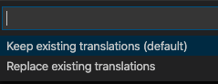

# Auto Translate JSON

Adds a menu item to JSON files to automatically translate them into other languages using Google Translate.

## How it works

When localizing an application, if you have a folder called something like `translations`, `languages`, or `i18n` that contains JSON files for each language, you can use this extension to right click on your primary language file and automatically create additional translations. It uses the Google Translate API to perform the translations, and you must have your own API key to make the calls.

Just create empty files with the locale names as filenames and this extension will generate their translations. For example, if you want French, create a file `fr.json`. Right click on `en.json`, pick "Auto Translate JSON" and wallah, you have a version in French.

## Features

- Option to keep existing translations, to cut down on data processing when adding new terms
- Option to keep extra translations, if one language has additional unique terms
- Supports nested JSON elements
- processes all files simultaneously

## Getting Started

1. Request a Google Translate API key
2. Install this extension
3. Go to VSCode `Settings>Extensions>Auto Translate JSON`

   

4. Enter your Google API API key
5. (optional) Change the `Source Locale` setting if you don't want English
6. Create empty files for each locale you want to translate into

   

7. Right click the source .json file (en.json by default) and pick "Auto Translate JSON"
8. At the prompt decide if you want to keep existing translations

   

9. At the prompt decide if you want to keep extra translations

   

10. Verify your language files have been updated

## Requirements

Since translation services are not free, you must provide your own Google API key. Luckily Google gives a decent amount of translations in a trial period. Go here to set up your account and request a key:

<https://console.developers.google.com/apis/library/translate.googleapis.com>

Once you have the key, which look something like "", paste it into the extension settings.

## Extension Settings

This extension contributes the following settings (Menu>Preferences>Settings):

- `auto-translate-json.sourceLocale`: A failsafe to prevent processing the wrong file. Defaults to "en" for english. You can change this to any valid two letter locale code you wish to use.
- `auto-translate-json.googleApiKey`: Enter your Google API key in this setting.

## Limitations

- all files need to be in the same folder. This does not support structures where each language is in it's own subfolder.

## Release Notes

### 1.0.2

Improved Documentation

### 1.0.1

Settings bug fix

### 1.0.0

Initial release of auto-translate-json
