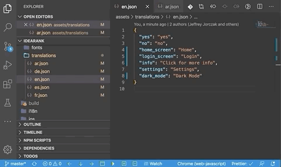
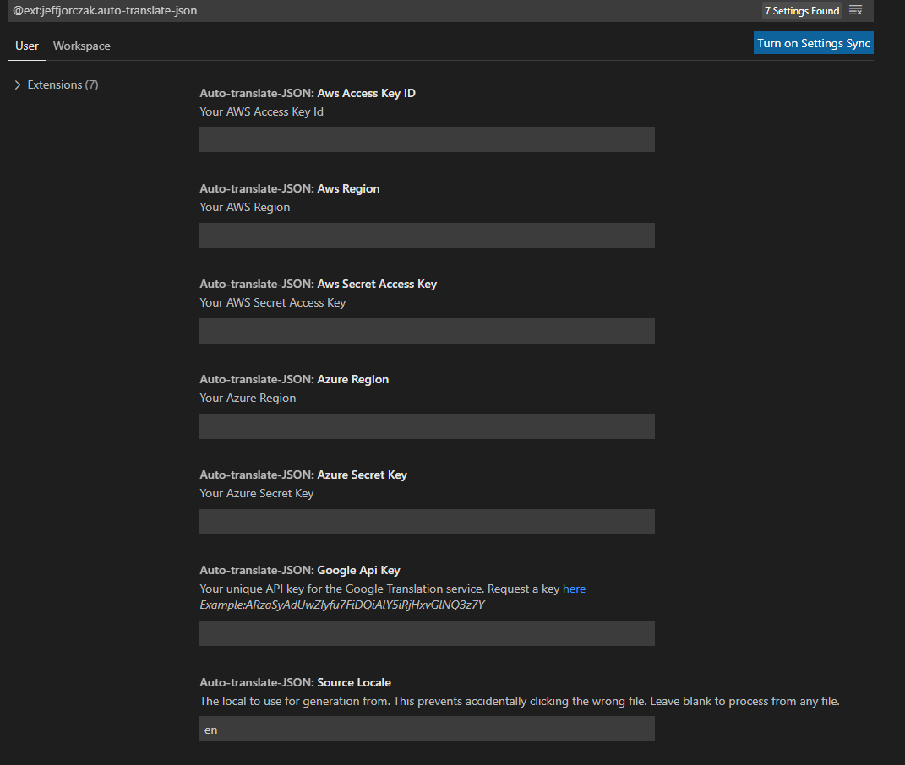
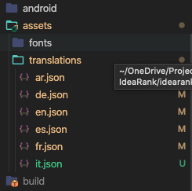
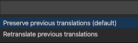

# Auto Translate JSON

Adds a context menu item to translation files to automatically translate them into other languages using Google Translate, AWS Translate, Azure Translate, DeepL, or OpenAI (including local AI via Ollama).

## Supported File Formats

- **JSON** - Standard JSON translation files
- **XML** - Android strings.xml, iOS plist, generic XML
- **YAML** - YAML/YML configuration files
- **ARB** - Flutter Application Resource Bundle
- **PO/POT** - GNU Gettext translation files
- **XLIFF** - XML Localization Interchange File Format
- **XMB/XTB** - XML Message Bundle (Angular)
- **Properties** - Java/Spring properties files
- **CSV/TSV** - Comma/Tab-separated values

## How it works

When localizing an application, if you have a folder called something like `translations`, `languages`, or `i18n` that contains translation files for each language, you can use this extension to right click on your primary language file and automatically create additional translations. It uses the Google/AWS/Azure/DeepL/OpenAI Translate API to perform the translations, and you must have your own API key to make the calls.

Just create empty files with the locale names as filenames and this extension will generate their translations. For example, if you want French, create a file `fr.json`. Right click on `en.json`, pick "Auto Translate" and voilà, you have a version in French.

## Features

- **Multi-format support** - Works with JSON, XML, YAML, ARB, PO, XLIFF, Properties, CSV, and more
- **Format auto-detection** - Automatically detects file format based on extension and content
- Option to keep existing translations, to cut down on data processing when adding new terms
- Option to keep extra translations, if one language has additional unique terms
- Supports nested elements in JSON, XML, and YAML
- Supports named arguments such as: "Zip code {zip} is in {city}, {state}."
- Processes all files simultaneously
- **Local AI support** - Use Ollama or other OpenAI-compatible local servers

## Supported languages

- Google: <https://cloud.google.com/translate/docs/languages>
- AWS: <https://docs.aws.amazon.com/translate/latest/dg/what-is.html#what-is-languages>
- Azure: <https://docs.microsoft.com/en-us/azure/cognitive-services/translator/language-support>
- DeepL: <https://www.deepl.com/docs-api/other-functions/listing-supported-languages/>
- OpenAI: <https://platform.openai.com/>

## Requirements

Since translation services are not free, you must provide your own API key.

For Google API key you need to provide just API key. Luckily Google gives a decent amount of translations in a trial period. Go here to set up your account and request a key:
<https://console.developers.google.com/apis/library/translate.googleapis.com>

For AWS you need to provide your access key and secret key. Go here to set up your account and request an access key and secret key and region to use:
<https://aws.amazon.com/premiumsupport/knowledge-center/create-and-activate-aws-account/>

For Azure you need to provide your subscription key and region. Go here to set up your account and request a subscription key:
<https://azure.microsoft.com/en-us/free/>

For DeepL you need to provide your authentication API key. Go here to set up your account and request an API key:<https://www.deepl.com/pro-api?cta=header-pro-api/>

For OpenAI you need to provide just API key.Go here to set up your account and request a key:
API key:<https://platform.openai.com/>

## Getting Started

1. Request a Google/AWS/Azure/DeepL/OpenAI Translate API key
2. Install this extension
3. Go to VSCode `Settings>Extensions>Auto Translate JSON`

   

4. Enter your Google/AWS/Azure API key / access key / subscription key / region
5. (optional) Change the `Source Locale` setting if you don't want English
6. (optional) Set the `Format` setting or leave as "auto" for automatic detection
7. Create empty files for each locale you want to translate into.
   Locale should correspond to the language code used by the translation service. For example, if you want French, create a file `fr.json` (or `fr.xml`, `fr.yaml`, etc.).
   
   - If you use Azure and want to translate into Serbian, create a file `sr-Cyrl.json` for Serbian Cyrillic translation or `sr-Latn.json` for Serbian Latin translation.
   - If you use AWS or Google and want to translate into Serbian, create a file `sr.json` for Serbian translation.

   

8. Right click the source translation file (en.json, en.xml, en.yaml, etc.) and pick "Auto Translate"
9. At the prompt decide if you want to preserve previously translated values (i.e. not reprocess)

   

10. At the prompt decide if you want to keep extra translations

   

11. Verify your language files have been updated

## Extension Settings

This extension contributes the following settings (Menu>Preferences>Settings):

### General

- `auto-translate-json.sourceLocale`: A failsafe to prevent processing the wrong file. Defaults to "en" for english. You can change this to any valid two letter locale code you wish to use.

- `auto-translate-json.mode`: "file": files in same folder like "en.json"...; "folder": files in subfolders like "en/translation.json"

- `auto-translate-json.format`: File format for translation. Use "auto" for automatic detection based on file extension. Supported formats: json, xml, android-xml, ios-xml, yaml, arb, po, pot, xliff, xmb, xtb, properties, csv, tsv

- `auto-translate-json.startDelimiter`: Start delimiter for named arguments. Defaults to "{". Use "{{" for ngx-translate or transloco.

- `auto-translate-json.endDelimiter`: End delimiter for named arguments. Defaults to "}". Use "}}" for ngx-translate or transloco.

- `auto-translate-json.ignorePrefix`: Translation keys that start with this prefix will be ignored (e.g., "@@" for ARB metadata)

### Google

- `auto-translate-json.googleApiKey`: Enter your Google API key in this setting.

### AWS

- `auto-translate-json.awsAccessKeyId`: Enter your AWS API access key Id in this setting.

- `auto-translate-json.awsSecretAccessKey`: Enter your AWS API secret access key in this setting.

- `auto-translate-json.awsRegion`: Enter your AWS region in this setting.

### Azure

- `auto-translate-json.azureSecurityKey`: Enter your Azure security key in this setting.

- `auto-translate-json.azureRegion`: Enter your Azure region in this setting.

### DeepL Free

- `auto-translate-json.deepLFreeSecurityKey`: Enter your DeepL Free security key in this setting.

### DeepL Pro

- `auto-translate-json.deepLProSecurityKey`: Enter your DeepL Pro security key in this setting.

### OpenAI

- `auto-translate-json.openAIKey`: Enter your OpenAI API key in this setting.
- `auto-translate-json.openAIBaseURL`: Base URL for OpenAI API. Defaults to "https://api.openai.com/v1". Change for local servers.
- `auto-translate-json.openAIModel`: Model to use. Defaults to "gpt-4.1-mini" (recommended for translations).
- `auto-translate-json.openAIMaxTokens`: Maximum tokens per request. Defaults to 1000.
- `auto-translate-json.openAITemperature`: Temperature (0-2). Lower values produce more consistent translations. Defaults to 0.1.

### Local AI with Ollama

1. Install [Ollama](https://ollama.com/)
2. Pull a recommended model: `ollama pull qwen2.5:14b`
3. Configure extension settings:
   - `auto-translate-json.openAIKey`: "ollama" (placeholder)
   - `auto-translate-json.openAIBaseURL`: "http://localhost:11434/v1"
   - `auto-translate-json.openAIModel`: "qwen2.5:14b"
   - `auto-translate-json.openAIMaxTokens`: 512

### Other Local AI Servers

Compatible with any OpenAI-compatible server:
- [Jan.ai](https://jan.ai/)
- [LM Studio](https://lmstudio.ai/)
- [text-generation-webui](https://github.com/oobabooga/text-generation-webui)
- [vLLM](https://github.com/vllm-project/vllm)

## Limitations

- Files must be named with the locale code that may be different depending on the translation service that you use. Please see the supported languages above.

## Format-Specific Notes

### ARB (Flutter)
- Keys starting with `@@` (like `@@locale`) are treated as metadata and not translated
- Set `ignorePrefix` to `@@` to skip metadata keys

### Android XML
- Automatically detects `<resources>` structure
- Preserves `translatable="false"` attributes

### PO/POT
- Preserves headers and metadata
- Handles plural forms

### XLIFF
- Supports XLIFF 1.2 and 2.0 formats

### Prices

- Google

<https://cloud.google.com/translate/pricing>

- AWS

<https://aws.amazon.com/translate/pricing/>

- Azure

<https://azure.microsoft.com/en-us/pricing/details/cognitive-services/translator/>

- DeepL

<https://www.deepl.com/pro?cta=header-prices>

- OpenAI

<https://openai.com/pricing>

### WARNING

Keep your keys safe!
